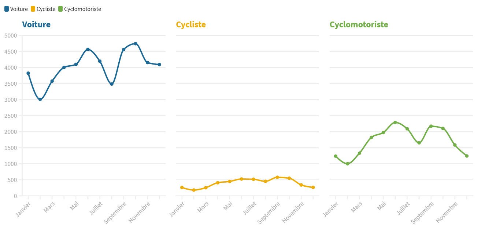
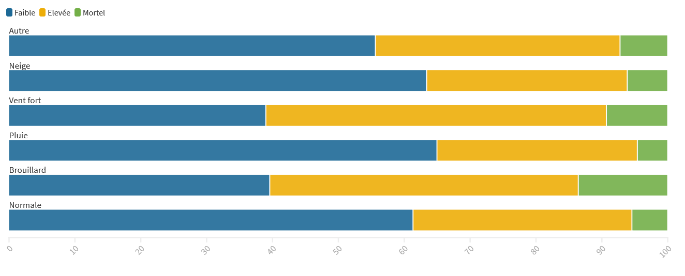
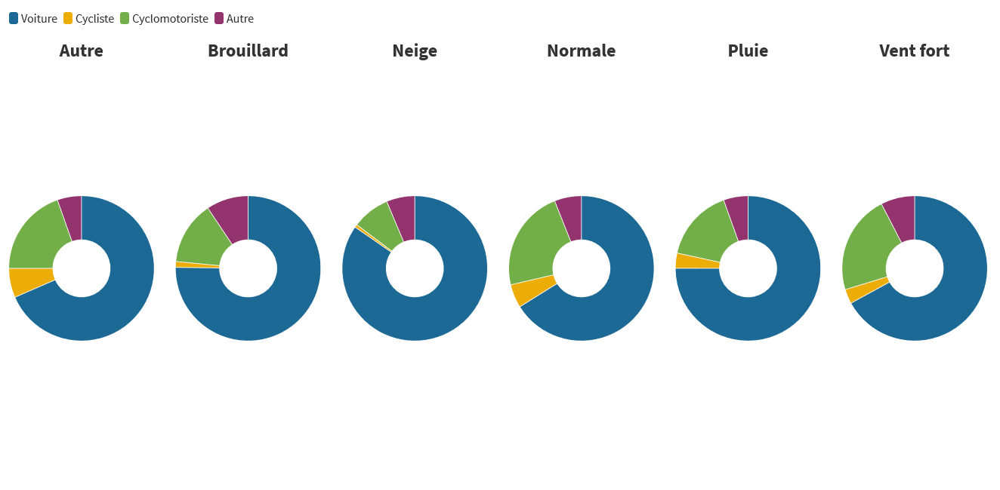

Après quatre années de stagnation ou de hausse de la mortalité routière en France, l’année 2018 apparaît comme l’année durant laquelle les statistiques de la Sécurité Routière ont enregistré les taux de mortalité les plus bas de son histoire. Cependant, tous les usagers ne sont pas épargnés au même titre.

Cette étude porte sur l’accidentologie routière en France, en 2018, et s’articule sur l’impact des différentes conditions météorologiques, afin de déterminer si celles-ci jouent un rôle important ou non en tant que facteur d’accidentologie. 

En parallèle, nous avons focalisé l’analyse pour savoir quelle catégorie de véhicules est davantage touchée selon ces mêmes conditions météorologiques.

Ainsi, qu’il pleuve, qu’il neige, qu’il vente, qu’il fasse beau ou qu’il y ait du brouillard, le nombre d’accidents a tendance à varier, et les usagers de la route ne vont pas être impactés de la même façon dans leur conduite, et ne se comportent pas de la même manière. La gravité même de l’accident serait en corrélation avec les conditions météorologiques.

## **Une base de données sur les accidents corporels de la circulation routière en 2018**

Dans cette analyse, nous nous basons sur les données principales trouvées sur la <a target="_blank" rel="noopener noreferrer" href="https://www.data.gouv.fr/en/datasets/bases-de-donnees-annuelles-des-accidents-corporels-de-la-circulation-routiere-annees-de-2005-a-2019/#_">TEST</a>[base de données des accidents corporels de la route](https://www.data.gouv.fr/en/datasets/bases-de-donnees-annuelles-des-accidents-corporels-de-la-circulation-routiere-annees-de-2005-a-2019/#_) publiée annuellement par le ministère de l’Intérieur. Nous nous sommes concentrées sur 2018 pour étudier, le temps d’une année, l’impact des conditions météorologiques sur l’accidentologie routière.

Depuis la base de données, nous avons utilisé les fichiers suivants :

*   Caractéristiques  2018
*   Véhicules 2018
*   Usagers 2018
*   Descriptif des bases de données

Pour faciliter notre étude, nous avons fait le choix de regrouper sous 4 grandes catégories l’ensemble des véhicules ayant été impliqués dans au moins un accident au cours de l’année 2018. En voici le descriptif : 

*   La catégorie ‘Voiture’ comprend :  Véhicule léger, Voiturette, Véhicule léger + remorque, Véhicule léger + Caravane, Véhicule utilitaire, etc.
*   La catégorie ‘Cyclistes’ comprend : Bicyclette
*   La catégorie ‘Cyclomotoristes’ comprend : Cyclomoteur, Scooter, Motocyclette de différentes catégories (cm3)
*   La catégorie ‘Autre’ comprend : Poids lourd, Tracteur, Train, Tramway, Autobus, Quad, Piéton en roller/trottinette

Pour les conditions météorologiques, nous les avons regroupées sous 6 grandes catégories :

*   La catégorie ‘Normale’ 
*   La catégorie ‘Brouillard’ comprend : Brouillard et Fumée
*   La catégorie ‘Neige’ comprend : Neige et Grêle
*   La catégorie ‘Pluie’ comprend : Pluie légère et Pluie forte 
*   La catégorie ‘Vent fort’ comprend : Vent fort et Tempête
*   La catégorie ‘Autre’  comprend : Temps éblouissant, Temps couvert, et autre.

Pour la gravité de l’accidentologie, nous les avons regroupé  sous 3 grandes catégories :  

*   La catégorie ‘Faible’ signifie qu’au moins un des usagers impliqués dans l’accident a été un blessé léger.
*   La catégorie 'Élevée' signifie qu’au moins un des usagers impliqués dans l’accident a été hospitalisé.
*   La catégorie ‘Mortel’ signifie qu’au moins un des usagers impliqués dans l’accident a été tué.

Pour comprendre l’étude qui suit, il faut avoir en tête qu’un accident présenté comme Accident de voiture est un accident au sein duquel au moins une voiture a été impliquée; un accident de cycliste est un accident au sein duquel au moins un cycliste a été impliqué; un accident de motocycliste est un accident au sein duquel au moins un motocycliste a été impliqué. Cela implique la présence possible d’une catégorie similaire ou différente de véhicule impliqué dans ce même accident. De ce fait, il en est de même concernant la gravité de l’accidentologie. Ex: Un accident de voiture mortel est un accident au sein duquel au moins une voiture a été impliqué et au moins un usager a été tué. Il peut s’agir de l’usager de la voiture, comme il peut s’agir de l’usager de l’autre catégorie de véhicule impliqué dans l’accident. Voilà les limites de notre étude.

**Près des trois quarts des accidents de la route impliquent des voitures en condition météorologique dite normale** \
Nombre d’accidents corporels de la route en 2018 par véhicules, en fonction des conditions météorologiques

D’après ces seconds résultats, le constat est clair : près des trois quarts des accidents impliquent au moins une voiture, en 2018. 

La condition météorologique dite “normale” est celle qui, toutes catégories de véhicules confondues, comporte le plus d’accidents corporels de la route, la pluie étant la seconde.  \
A noter que, le nombre de jours de pluie varie en France de 40 à 180[^1] jours par an; ce qui peut expliquer qu’il y ait moins d’accidents en cas de pluie, car il y a moins de jours de pluie que de “beaux jours” en général.

Il y a également moins d’accidents impliquant au moins un cycliste par jours de pluie, de neige ou de vent car les cyclistes circulent moins quand le temps n’y est pas favorable.

La majorité des accidents en 2018 ont impliqué au moins une voiture et se sont déroulés sous des conditions météorologiques “normales” (ciel dégagé, pas d’humidité, pas d’obstacles à cause du vent…). 

Sachant que les conducteurs de voitures sont les usagers les plus fréquents sur les routes, nous pouvons sur la base de cette visualisation émettre l’hypothèse que ces usagers sont moins attentifs à leur conduite et à la route quand les conditions météorologiques s’avèrent en réalité être plus favorables, ce qui pourrait expliquer les données.

**Une répartition irrégulière des usagers de la route en fonction des conditions météorologiques** \
Répartition des victimes selon le mode de déplacement, par différentes conditions météorologiques, en 2018, en France, en pourcentages

Ces premiers résultats laissent clairement entendre une influence des conditions météorologiques sur l’accidentologie routière en France en 2018 et du choix du mode de transport selon le temps. Selon celles-ci, les accidents impliquant certaines catégories d’usagers se font plus rares ou plus fréquents.

Les accidents de la route impliquant au moins un cycliste semblent les plus fréquents en temps normal, et par opposition, absents par temps de neige ou pluie. On peut cependant nuancer ce propos : les cyclistes se font évidemment plus rares en ces temps. Les conditions météorologiques influencent grandement le choix du mode de transport et par conséquent les résultats sur l’accidentologie des usagers.

Les accidents de la route impliquant au moins une voiture représentent les ¾ des accidents de la route en 2018, toutes catégories de conditions météorologiques confondues. Ceux-ci sont tout de même plus fréquents par temps de neige et de pluie.

Cependant, cette visualisation ne fait que l’état des lieux de la répartition des accidents qui se sont produits en 2018, selon le mode de déplacement, par les conditions météorologiques. Afin d’étudier l’impact réel des différentes conditions météorologiques sur le nombre même d’accidents, nous avons précisé notre étude.

**La saisonnalité représentative de la météorologie : des usagers plus attentifs lors d’une météo capricieuse ?** \
Evolution du nombre d’accidents au cours de l’année 2018 en France, par catégorie de véhicules 

Les évolutions au fil des saisons du nombre d’accidents sont assez similaires chez les voitures et les cyclomotoristes. Chez les cyclistes, en revanche, elles sont plus constantes au fil de l’année. Concernant les deux catégories précédentes, il existe, au fil des saisons,  des pics d’accidents plus ou moins révélateurs : 

Toutes catégories confondues, le mois de janvier, par contraste avec le mois de février, est un mois particulièrement accidenté. A partir de ce second mois, il y a une nette augmentation du nombre d’accidents, et ce, jusqu’au mois de juin. De juin à août, la courbe s’inverse.  

Par la suite, on observe, un pic très fort d’août à octobre, chez toutes les catégories de véhicules. Quelle hypothèse ? “_En moyenne, sur la France et sur la saison, la pluviométrie a été déficitaire de 10 %”_[^2]. La météo dans ces périodes étant en général plus clémente, les usagers sont moins attentifs sur les routes et donc il y a plus d’accidents. 

L’explication peut venir également du fait que ces mois-là sont des mois de vacances, et de “rentrée”, où beaucoup d’usagers prennent la route. 

En fin d’année, sur la période d’octobre à décembre, le nombre d’accidents de la route diminue particulièrement. Or, cette période est associée à des conditions météorologiques particulières : pluie, neige, orage, brouillard, etc. Cette analyse nous amène à confirmer la  théorie selon laquelle les usagers sont davantage attentifs sur les routes lorsque la météorologie est capricieuse et se dégrade que quand celle-ci est normale et favorable.

Pour les cyclistes, la courbe est plus linéaire. Comme déjà souligné, les cyclistes sont moins impactés par les conditions météorologiques, ceux-ci utilisant généralement peu ce moyen de transport en cas de temps capricieux.

**Gravité de l’accidentologie : en cas de brouillard, 13% des accidents sont mortels** \
Proportion d’accidents de gravité faible, élevée ou mortels, par conditions météorologiques, en 2018, en France, en pourcentages

La proportion d’accidents de gravité “faible”, “élevée” ou “mortelle” est différente selon les conditions météorologiques en 2018. 

En cas de brouillard, environ 13% des accidents sont mortels, et nous voyons ici que c’est la condition météorologique qui tue le plus sur la route. Le brouillard fait partie des conditions météorologiques les moins fréquentes dans l’année : pour la majorité du territoire métropolitain la moyenne globale est de 40 à 50 jours de brouillard par an[^3]; et donc la plus difficile à gérer pour les usagers de la route. Elle est également considérée comme l’une des conditions les plus gênantes dans la conduite, et donc la plus propice aux accidents mortels.

En cas de vent fort ou de brouillard, les accidents semblent plus graves : seulement 40% des accidents ont de faibles conséquences. En effet, en vent fort, il y a à peu près 8% d’accidents mortels, ce qui est également conséquent. 

Quand le temps est normal, plus de 60% des accidents sont de gravité faible, à peu près 35% d’entre eux de gravité élevée et à peu près 5% sont mortels. 

La condition météorologique pour laquelle le taux de mortalité est le plus faible est la pluie (un peu moins de 5%) : les usagers sont davantage attentifs en cas de pluie.

**Mortalité sur les routes : les cyclomotoristes plus impactés par temps de vent fort** \
Répartition de la mortalité, selon le mode de déplacement, par conditions météorologiques, en France, en 2018, en pourcentage

La répartition de la mortalité selon les modes de déplacement, par conditions météorologiques, démontre que c’est par temps de vent fort que la catégorie des cyclomotoristes est la plus exposée. Cela pourrait être expliqué par l’effet “d’appel d’air” que subissent ces usagers qui entraînent très souvent des accidents considérables.

_Petite explication_ : un deux-roues, une moto par exemple, a un centre de gravité différent des autres usagers et une prise au vent plus importante car il n’a pas de carrosserie intégrale. Le vent, lui, n’est pas linéaire et comprend des changements de force et de sens. Lorsqu’en plus, des éléments extérieurs tels que des constructions, de la végétation ou des véhicules sont présents, cela change la donne. Par exemple, lorsqu’une moto double deux poids lourds en temps de vent, le camion va faire office de coupe-vent pendant un moment mais entre les deux poids lourds, un appel d’air (repoussant ou aspirant) va avoir lieu, ce qui peut être déstabilisant si le motard n’anticipe pas cet effet physique. De plus, les deux-roues protègent moins les usagers qu’une voiture, l’accident a donc plus de risque d’être mortel, surtout avec la présence importante des glissières de sécurité au bord des routes qui sont de véritables “coupes gorges” pour ces usagers.

Cependant, toutes conditions météorologiques confondues, ce sont les accidents impliquant au moins une voiture qui ont le plus de risque d’être mortels. Bien entendu, c’est une information à nuancer. Près des ¾ des accidents en France, en 2018 sont des accidents impliquant au moins une voiture. Ici, nous voyons que les accidents mortels les concernent également en majorité, les cyclomotoristes étant les seconds usagers les plus vulnérables. C’est par temps de neige que les accidents impliquant au moins une voiture ont le plus de risque d’être mortel.

Concernant les cyclistes, sans surprise, c’est en temps normal, que les accidents mortels ont le plus de risque de se produire, suivi des temps pluvieux et de vent fort, les temps favorables à la circulation de ce mode de transport, en contraste avec les temps de neige et de brouillard. 

## **Que nous enseigne cette analyse ?**

Pour conclure cette analyse, les conditions météorologiques sont, en effet, corrélées au taux d’accidents de la route, mais leurs effets comprennent des limites. 

_Les points à retenir_ : 

En 2018,

*   Près de trois quart des accidents impliquent au moins une voiture ; celle-ci étant la catégorie de véhicule la plus utilisée par les usagers en général.
*   Le nombre d’accidents en condition météorologique normale est le plus élevé : les usagers sont sûrement moins attentifs quand la météo s’avère plus favorable à la circulation. A l’inverse, les usagers sont plus attentifs en cas de météo capricieuse, car moins habitués à conduire sous celle-ci. 
*   Les cyclistes sont moins impactés par les conditions météorologiques car ils privilégient, en général, ce moyen de transport majoritairement en cas de beau temps. 
*   En cas de brouillard, 13% des accidents sont mortels : c’est la condition météorologique qui cause le taux d’accidentologie mortel le plus élevé. 
*   Les cyclomotoristes sont plus impactés en cas de vent fort : les appels d’air sont plus fréquents et plus compliqués à gérer pour ces usagers. 

## **Boîte noire**

**Méthodologie générale**

Les recherches des données sur l’accidentologie routière se sont déroulées sur de nombreux sites : _data.gouv, Google Datasearch, OpenDataSoft_…

La problématique que l’on a rencontré à ce niveau était d’obtenir un fichier en CSV pouvant être lu par tous les sites de visualisation de données. Nous avons dû faire des manipulations pour le rendre utilisable. Ce but en tête, nous avons utilisé l’outil _WorkBenchData_ pour pouvoir réunir au même endroit toutes les données que nous avions recueillies. Nous avons également utilisé Excel, afin de remanier notre fichier dans les conditions adaptées à chacune des visualisations utilisées ci-dessus. 

Nous avons commencé notre démarche par faire une visualisation sous forme de dessins, pour voir quelles étaient nos hypothèses, et quels types de visualisation seraient intéressantes pour répondre à notre sujet. C’est à partir de là que le choix des sites de data-visualisation ont été instinctifs. _Flourish _a été l’outil le plus simple pour nous pour effectuer nos visualisations. 

**Limites**

Tout au long de notre projet, nous avons rencontré de nombreux obstacles que nous avons dû surmonter de différentes façons : redéfinition de notre problématique, changement de direction, redirection vers de nouveaux logiciels de traitements de données...

Tout d’abord, nous avons rencontré des difficultés dans la recherche de données à exploiter. Nous voulions étudier l’impact de la grève des transports de la part de la SNCF/RATP de décembre 2019 sur l’accidentologie routière en Île-de-France. L’absence partielle voire totale de transports en commun semblait intéressante à étudier. Une augmentation du trafic en Ile-de-France ? Une augmentation de l’accidentologie routière durant cette période de grève ? Voilà des questions auxquelles nous aurions aimé répondre à l’issue de notre étude. Cependant, nous ne trouvions que des données non exploitables (formats pdf, etc). De plus, les sites officiels du ministère de l’intérieur (_data.gouv_) n’étaient pas mis à jour. Nous avons donc décidé de changer de sujet et d’étudier l’impact de la saisonnalité et de la météorologie sur l’accidentologie routière en France, en 2018.

Par la suite, c’est dans la préparation des données que nous avons rencontré des difficultés. Rassembler toutes les données trouvées au même endroit, les harmoniser, recoder, mettre en forme dans le but de les rendre exploitables s’est avéré être plus compliqué que prévu. Nous avons notamment dû apprendre à utiliser des logiciels jusqu’alors inconnus des membres de notre groupe, notamment_ WorkbenchData_. Il a également fallu développer une compréhension profonde de la statistique, pour manipuler nos données avec justesse, et utiliser les visualisations adaptées, pour faire passer notre message.

Enfin, concernant notre étude, il aurait été intéressant d’approfondir et préciser les facteurs d’accidentologie en incluant l’agenda des français (vacances, fêtes…), les horaires des accidents ainsi que les départements et la situation urbaine (zone rurale ou ville) dans lesquels ils se sont produits. A suivre...

<!-- Footnotes themselves at the bottom. -->
## Notes

[^1]:
     [https://meteofrance.com/comprendre-climat/france/le-climat-en-france-metropolitaine](https://meteofrance.com/comprendre-climat/france/le-climat-en-france-metropolitaine) 

[^2]:
     [http://www.meteofrance.fr/climat-passe-et-futur/bilans-climatiques/bilan-2018/bilan-climatique-de-l-annee-2018#](http://www.meteofrance.fr/climat-passe-et-futur/bilans-climatiques/bilan-2018/bilan-climatique-de-l-annee-2018#) 

[^3]:
     [http://www.meteo-express.com/brouillard-annuel.html](http://www.meteo-express.com/brouillard-annuel.html) 
